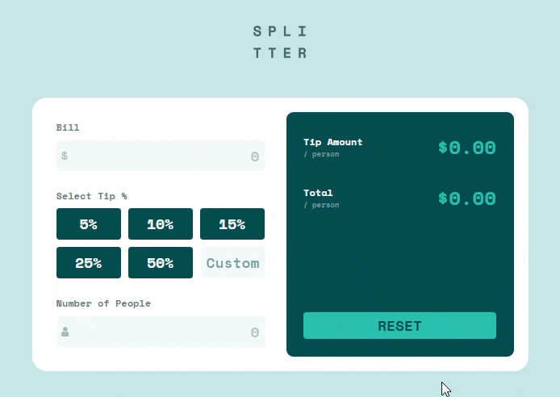

# Frontend Mentor - Tip calculator app solution

This is a solution to the [Tip calculator app challenge on Frontend Mentor](https://www.frontendmentor.io/challenges/tip-calculator-app-ugJNGbJUX).
Frontend Mentor challenges help you improve your coding skills by building realistic projects.

## Table of contents

- [Overview](#overview)
  - [The challenge](#the-challenge)
  - [Screenshot](#screenshot)
  - [Links](#links)
- [Built with](#built-with)
- [Author](#author)

## Overview

### The challenge

Users should be able to:

- Calculate the correct tip and total cost of the bill per person
- View the optimal layout for the app depending on their device's screen size
- See hover states for all interactive elements on the page

### Screenshot

### Links

- Solution URL: [Code on GitHub](https://github.com/DmitryMuzalev/tip-calculator-app-ts)
- Live Site URL: [Live on GitHub Pages](https://dmitrymuzalev.github.io/tip-calculator-app-ts/)

## Built with

- React 18
- TypeScript
- Flexbox
- CSS Grid
- SCSS

## Author

- Github - [DmitryMuzalev](https://github.com/DmitryMuzalev)
